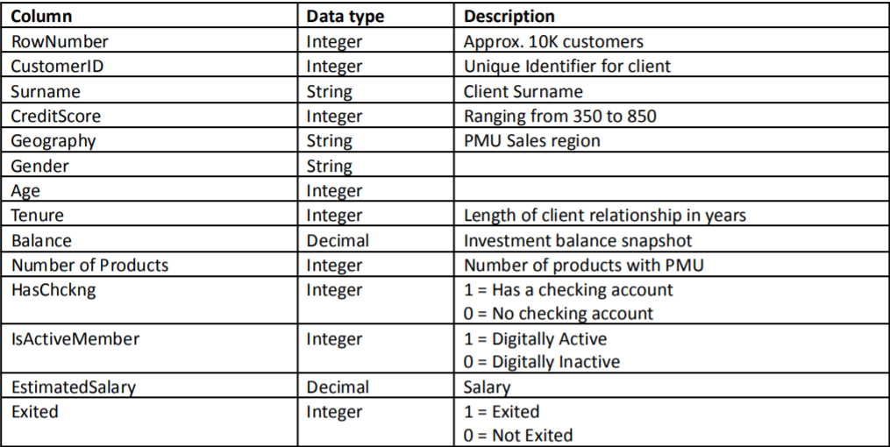

Customer Churn Analysis

An Exploratory Data Analysis using Python

Context

Portfolio Management Unit (PMU), a business unit of an MNC has comprised a user-based portfolio of which a dedicated
banker offers comprehensive financial planning and investment management advice to individuals.

Prompt

A key priority for the Portfolio Management Unit is building and maintaining long-term relationships with clients.
Management has asked you to develop analytically based measures to generate a report on the possible factor/s on which
clients have discontinued the services of PUM. The goal of the exercise is to do exploratory analysis and provide your
insights along with strategies to build to stem attrition/customer churn.

Dataset

The final Dataset will consist of 14 variables:

For refining and visulization the data set used below libraries

1. https://pandas.pydata.org/pandas-docs/stable/index.html
2. https://seaborn.pydata.org/index.html
3. https://matplotlib.org/stable/index.html

For putting data into single file and analysing used merge function of pandas, which will merge the dataframes on the
basis of customer ID, which works as a join for the fields.

After merging drop_duplicates methods used for remove duplicated rows present in dataframe.

Analyze NAN values and replace NAN values with mean of that column using fillna method of pandas.

Analyze the refine dataframe and create visulizations from them

1. How many users (%) are from different geography (pie charts using matplot lib).
2. How many users exited(0/1) from different geography.
3. How many users exited(0/1) from gender wise.
4. How many male and female exited from different geography.
5. Number of products available gender wise and geography wise.
6. How many of are active and Non Active Members in the service which are not exited.
